# 17.1 Data Visualization with Leaflet

## Overview

Today's lesson will be spent introducing students to data visualization with maps. Students will gain a basic understanding of the Leaflet.js mapping library before diving headfirst into a number of increasingly involved examples.

## Class Objectives

* Students will understand the benefits that visualizing data with maps can provide.
* Students will learn the basics of creating maps and plotting data with the Leaflet.js library.
* Students will gain an understanding of the GeoJSON format.
* Students will understand the concept of layers and layer controls and how we can use them to add interactivity to our maps.

## Instructor Prep

  
<strong>Instructor Priorities</strong>

* Students should understand the advantages gained by visualizing data in a geographical context.

* Students should be able to create a new map and perform basic functions with the Leaflet JavaScript library.

* Students should gain an understanding of the GeoJSON format.

  
<strong>Instructor Notes</strong>

* There is a fair amount of live coding in this lesson, so make sure to look over the exercises before class. Finished versions of each exercise are provided in the activities folder.

* The final activity in this unit uses d3.json() and will need to be opened with a local server instance. Run `python -m http.server` and visit the generated url. If you prefer, all of the activities can also be opened with a server running.

* Much of the work of setting up a map is the same across examples. Feel free to use the same HTML file or copy and paste the code.

* You will need to replace the provided [mapbox tokens](https://github.com/coding-boot-camp/DataViz-Lesson-Plans/blob/b513aae86042f801de052cec8e8c20b912cf0ebf/01-Lesson-Plans/17-Mapping-Web/1/Activities/01-Ins_Basic_Map/Solved/config.js) with your [own](https://www.mapbox.com/api-documentation/#access-tokens) in the instructor activities.

* Throughout class, encourage students to leverage the [Leaflet Documentation](http://leafletjs.com/). They are among the best we'll work with throughout the entire course.

* Please reference our [Student FAQ](../../../05-Instructor-Resources/README.md#unit-17-geojson-and-leaflet) for answers to questions frequently asked by students of this program. If you have any recommendations for additional questions, feel free to log an issue or a pull request with your desired additions.

  
<strong>Sample Class Video</strong>

* To view an example class lecture visit (Note video may not reflect latest lesson plan): [Class Video](https://codingbootcamp.hosted.panopto.com/Panopto/Pages/Viewer.aspx?id=d484005e-c068-454b-976a-a87101839e27)

- - -

# Class Activities

## 1. Welcome & Our First Leaflet Map

| Activity Time:       0:20 |  Elapsed Time:      0:20  |
|---------------------------|---------------------------|

  
<strong>📣 1.1 Instructor Do: Welcome Students and Introduce This Week's Topic (0:10)</strong>

* Welcome your students to class and give them a brief introduction to this week's agenda: we will be using Leaflet.js to create beautiful and informative maps.

* Why visualize data in a geographical context?

  * Mapping data can give us insight that looking at 'flat-data' might not provide us with. To help illustrate this, slack out the following links and demonstrate them live to the class:

  * [Mapping the Spread of Drought Across the U.S.](https://www.nytimes.com/interactive/2014/upshot/mapping-the-spread-of-drought-across-the-us.html?_r=0)

      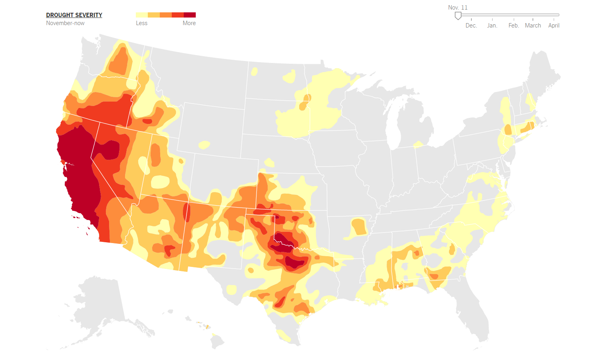

  * [Understand and Predict Zika In Brazil With Spatial Analysis](https://carto.com/blog/understand-and-predict-zika-in-brazil)

      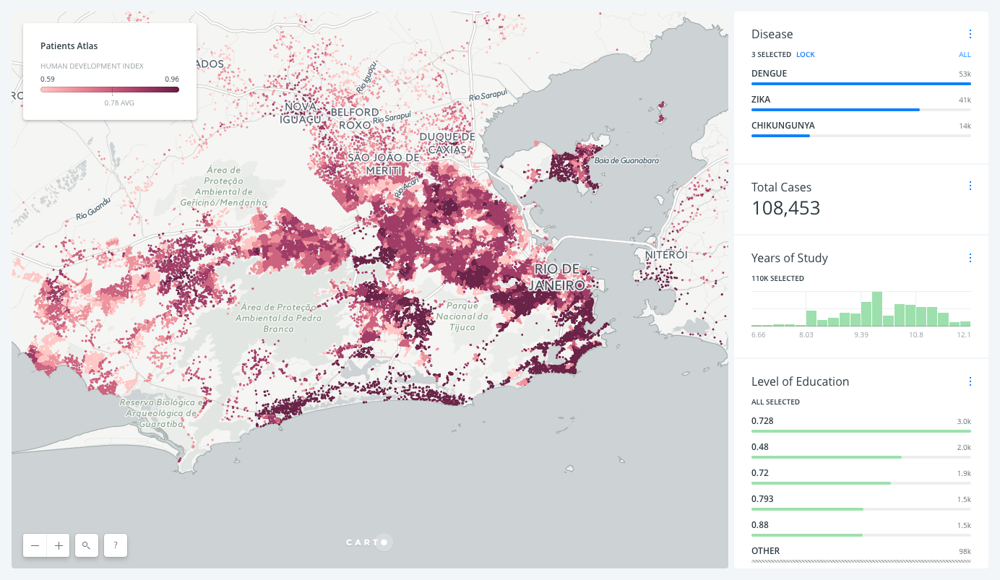

  * [Spotify - Musical Map of the World](https://spotifymaps.github.io/musicalcities/)

      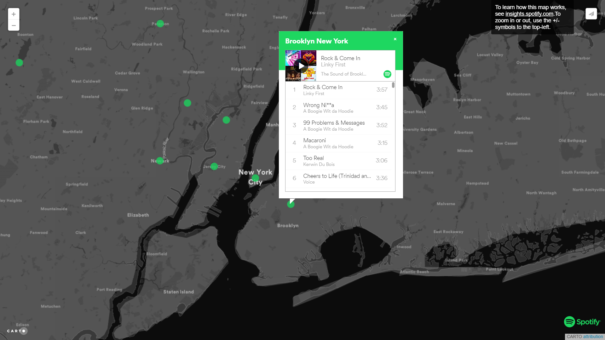

* Open the subject for discussion with students. What kind of datasets or problems are suitable for this type of data visualization?

  
<strong>🎉 1.2 Everyone Do: Introduce Leaflet & Our First Map (0:10)</strong>

* Open the [Leaflet.js web-page](http://leafletjs.com/) and have students visit the website on their computers. Encourage them to take a look around, as this is the library we will be using for the majority of the unit.

* For the first exercise, you're going to have the class follow along with you as you run through the code used to build the Leaflet map found in [Ins_Basic_Map](Activities/01-Ins_Basic_Map). Open it up and show it demonstrate it to the class. Let the students know that this is the most basic map you can make with Leaflet and that it will be our starting point in the wonderful world of geospatial data visualization!

  

* Open the `logic.js` file in your editor and walk through the key aspects of the code together:

  * **Map Object:**

    * `L.map` accepts two arguments:

      1. the first is the `id` of the HTML element which Leaflet should insert the map into.

      2. The second is an object containing initial options for the new map ("center" and "zoom" in this example).

  * **Tile Layer:**

    * Explain to students that a tile layer is like the background image of our map. Currently, our tile layer is the only thing we see when we open the basic map. Leaflet doesn't provide us with a tile layer out of the box. Instead, it gives us the option to use various tile layer APIs. Here we're using the Mapbox API. We configure our tile layer by:

      1. Passing in a formatted `queryURL` to the `tileLayer` method.

      2. Then we add our layer to our map with the `addTo` method. We will invoke this method whenever we want to add something to a map!

* Send the link to the Leaflet quick start guide: [https://leafletjs.com/examples/quick-start/](https://leafletjs.com/examples/quick-start/). Together as a class, walk through the steps of setting up a basic map with Leaflet.

1. Create a new HTML file.

2. Add links to the Leaflet CSS and JavaScript libraries.

3. Create a `
` with an `id` of `map`. This is where our map will be inserted.

   

   * Two JavaScript files are referenced. The first, `config.js`, holds the API key. The second, `logic.js`, holds the JavaScript map code.

4. Next, create a `logic.js` file and link it to the HTML.

5. Write or copy and paste the following code into your `logic.js` file. Explain each of these steps as you live code them:

   

   * The map object is defined with the `L.map` method.

   * Its first argument, `"map"`, is the `id` of the container which the map should be inserted into. It points to the `div` with the `id` `map` that we just created.

   * Its second argument is an object containing any initial configuration. It sets the initial coordinates on the `center` property.

   * The zoom level is set with the `zoom` property.

      

6. Add a tile layer to the map.

   

   * In the `accessToken` property, the `API_KEY`, or the token, is supplied by an external `config.js` file.

7. For this step, students need to create a free account with [Mapbox](https://mapbox.com) and [generate a token](https://www.mapbox.com/studio/account/tokens/) to get started.

8. Once everyone has an account and can generate a token, navigate to [https://www.mapbox.com/api-documentation/#maps](https://www.mapbox.com/api-documentation/#maps) and explore some of the map stylings that are available:

   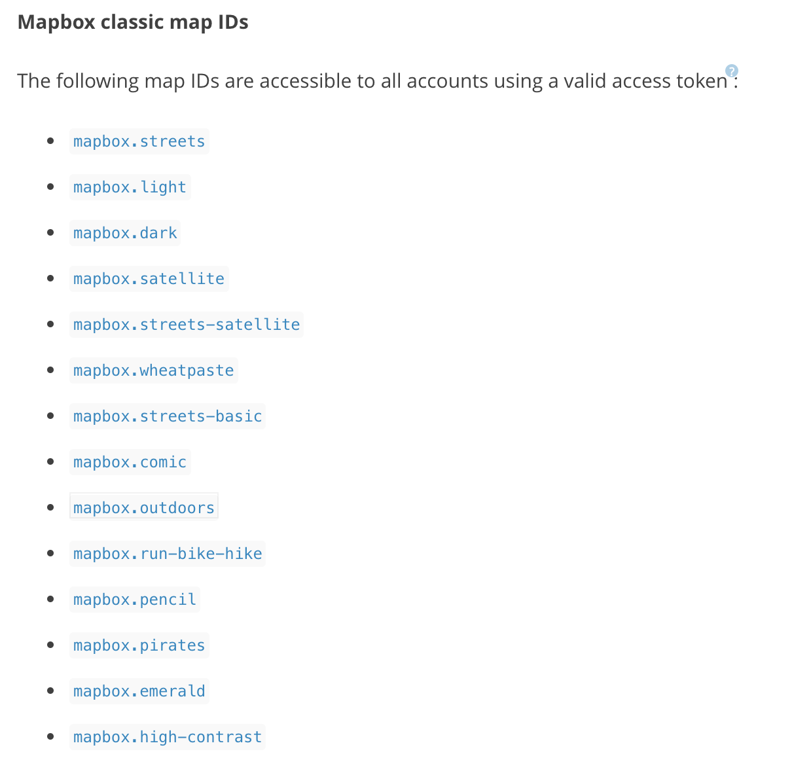

9. Explain that the API token is held in `config.js`.

   

   * In the HTML file, it must be referenced before `logic.js`.

10. Finally, we need to give our map some CSS styling to make it visible on the page. The following CSS will allow our map to take up the entire page.

    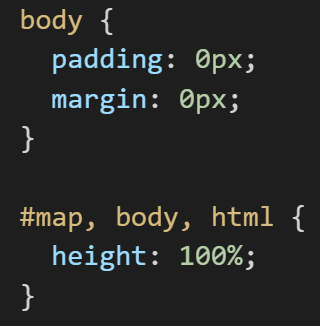

11. Now open the HTML file in your browser. Yay, we have a map!

    

* Spend some time troubleshooting any problems students may have. If they can't set up a map properly, they won't be able to do **ANYTHING** else in class today. Use this opportunity to have students who were able to create the map help students who were unable to.

[Having issues with this activity? Report a bug!](https://bit.ly/2URy5pR)

- - -
  
## 2. Quick Labeling Exercise

| Activity Time:       0:25 |  Elapsed Time:      0:45  |
|---------------------------|---------------------------|

  
<strong>📣 2.1 Instructor Do: Add Markers To The Map (0:05)</strong>

* Using [Ins_Markers](Activities/02-Ins_Markers) as a guide, show students how we can add a new marker to the map by creating a new marker object.

  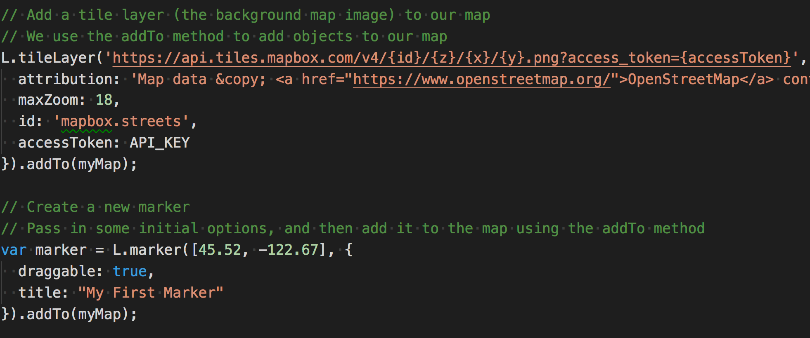

  * The `addTo()` method is used to add each map layer.

* We pass in starting coordinates for this marker and then any of the options detailed in the [Leaflet marker documentation](http://leafletjs.com/reference-1.0.3.html#marker-option). In this case, we made the marker `draggable` and added a `title` which appears when you hover over it.

    

* Note that we call the `addTo` method on our new marker object to add it to the map.

* Another useful feature Leaflet gives us is the ability to add popups to our markers. Using the `bindPopup` method, we can add information to our marker that will appear when we click it.

    

* Here's what our finished map will look like:

    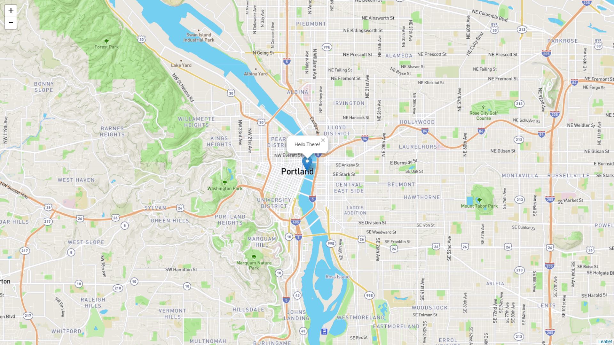

* Be sure to slack out the link to the [Leaflet Marker Documentation](http://leafletjs.com/reference-1.0.3.html#marker-option) before the next activity.

  
<strong>✏️ 2.2 Students Do: Quick Labeling Exercise (0:15)</strong>

* In this activity students will be plotting markers for various US Cities using Leaflet.

* **Instructions:** [README](Activities/03-Stu_City_Markers/README.md)

  
<strong>⭐ 2.3 Review: Marker Exercise (0:05)</strong>

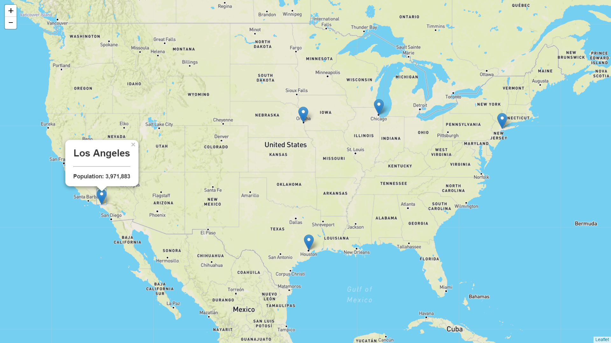

* Go over the solution to the last activity, [Stu_City_Markers_Solved](Activities/03-Stu_City_Markers/Solved), together as a class.

* Make sure to highlight key concepts from this activity and ask students the following:

  1. Why did we use a loop to create the markers?

     * Rather than write code to plot each individual marker manually, we can store our location data inside of an array of objects we loop through to plot them programmatically. Inform students know that the loop isn't required, but it's a little more DRY and organized to do it this way.

  2. What's `bindPopup` for?

     * The `bindPopup` method to attach popups to marker objects. Point out how we can insert HTML and CSS inside of the `bindPopup` method.

  3. What about the `addTo` method? What do we use that for? What argument does it take?

     * Here we're using the `addTo` method to add markers to the map.

       * Scroll back up to where `myMap` is defined to help students understand how all the code ties together.

  4. What two arguments does `L.marker` seem to receive?

     1. The coordinates for the new marker. Even though we're creating markers with a loop in this example, the first argument of the `L.marker` method is still an array of coordinates used to plot the marker

     2. Any other configuration we want to pass the new marker, such as a title, or whether it should be draggable or not.

[Having issues with this activity? Report a bug!](https://bit.ly/3c3hGV4)

- - -
  
## 3. Other Types of Markers

| Activity Time:       0:30 |  Elapsed Time:      1:15  |
|---------------------------|---------------------------|

  
<strong>📣 3.1 Instructor Do: Other Types Of Markers (0:10)</strong>

* Markers are great, but what if we want to represent something that isn't just a single point on a map? Thankfully, Leaflet allows us to define and plot SVG shapes to use as markers, similarly to how we used SVG files with D3. We refer to these SVG layers as 'vector layers' when dealing with the Leaflet API.

* Open [Ins_Other_Markers](Activities/04-Ins_Other_Markers) in your browser and show off our various custom markers. Open the code in your editor and illustrate how these are defined.

  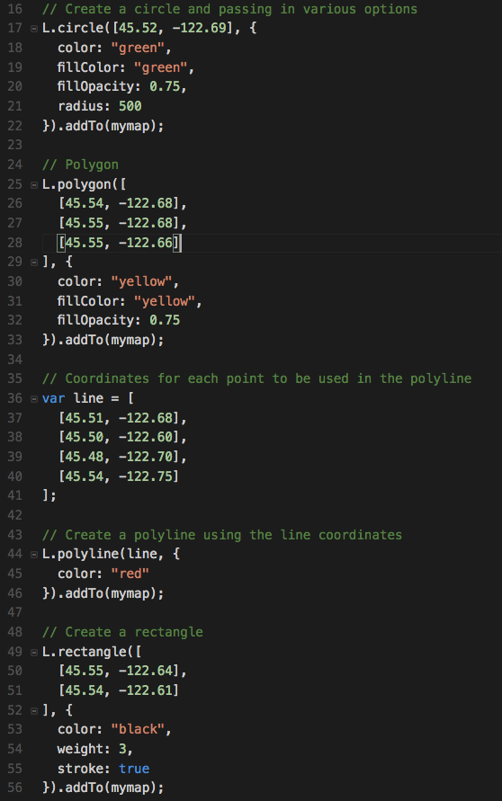

  1. Circles are defined with a center point and a radius.

  2. Other shapes and paths are defined using an array of coordinates to represent the sides or corners.

* Inform students that we can add a good deal of custom styling to these layers. Take a moment to change the styling of the various shapes (`fillColor`, `weight`, etc.) to demonstrate a few of the options we have to style vector layers.

  * A more extensive list of options available for styling our vector layers can be found in the Leaflet documentation in the [Path Options](http://leafletjs.com/reference.html#path) section. Slack out this link before the next activity.

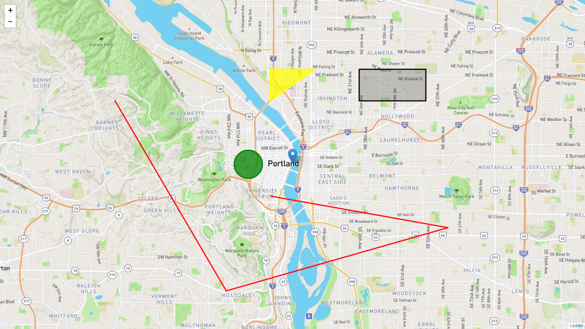
(Other Types of Markers)

* **Wait until after the next activity to slack out this example.**

  
<strong>✏️ 3.2 Students Do: Other Types Of Markers (0:10)</strong>

* In this activity students will work with different types of vector layers.

* **Instructions:** [README](Activities/05-Stu_Other_Markers/README.md)

  
<strong>⭐ 3.3 Review: Other Types Of Markers (0:10)</strong>

* Spend a few minutes answering any questions students might have about the previous activity.

* Make sure students have some understanding of the last activity by asking the following:

  1. What are some of the different types of vector shapes we have available to us? No need to list them all, but important ones to know for now are:

     1. Polyline

     2. Polygon

     3. Rectangle

     4. Circle

  2. What arguments do our vector layers accept when being created?

     1. An array of coordinates describing where our shape should appear

     2. A configuration object describing styles that should be applied to the shape. A complete list of style options for vector shapes can be found in the [Leaflet documentation for path options](http://leafletjs.com/reference-1.0.3.html#path-option) we can use to describe styles for our shape.

[Having issues with this activity? Report a bug!](https://bit.ly/2XhnJRz)

- - -

## Break

| Activity Time:       0:15 |  Elapsed Time:      1:30  |
|---------------------------|---------------------------|

- - -

## 4. World Cup Visualized

| Activity Time:       0:30 |  Elapsed Time:      2:00  |
|---------------------------|---------------------------|

  
<strong>📣 4.1 Instructor Do: City Population Visualized (0:10)</strong>

* Open [Ins_City_Population](Activities/06-Ins_City_Population) and demonstrate the new visualization.

  * We've replaced each marker from the City Markers activity with a vector layer whose size is proportional to the population of the city it represents.

  * We can control the size of a circle vector layer by adjusting its `radius`. In this case, we're setting the `radius` in pixels, with this ratio: the population divided by 40. We're dividing by 40 so that the vector layers will all fit on the screen.

  

  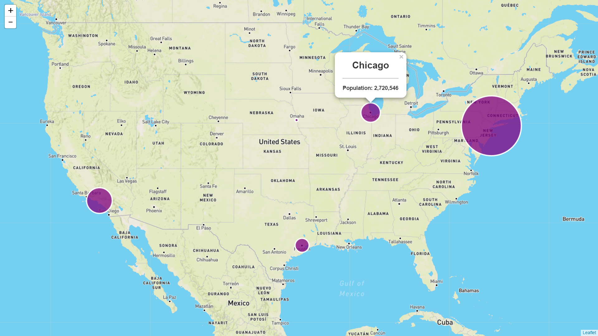(More populous cities have a larger map presence)

* Feel free to show students the code for this activity and give them a chance to ask any questions they may have now, but **don't slack out the code until after they have completed their next exercise.**

* Inform students that their next activity will be to create this visualization themselves.

  
<strong>✏️ 4.2 Students Do: World Cup Visualized (0:15)</strong>

* In this activity students will create graduated circle maps to represent the total amount of all-time 3 point wins for the top ten countries in the Fifa World Cup.

* **Instructions:** [README](Activities/07-Stu_Country_World_Cup/README.md)

  
<strong>⭐ 4.3 Review: World Cup Visualized (0:05)</strong>

* Spend a few minutes answering any questions students have about the previous activity.

* Make sure students understand the following key concepts:

  1. Setting our marker's `radius` based on countries points.

  2. Using conditionals to determine color.

  3. Using custom map styles as a way to express data.

  4. Using a popup to display additional information.

[Having issues with this activity? Report a bug!](https://bit.ly/2VapQ75)

- - -
  
## 5. Layer Activity

| Activity Time:       0:30 |  Elapsed Time:      2:30  |
|---------------------------|---------------------------|

  
<strong>📣 5.1 Instructor Do: Layer Groups & Layer Controls (0:10)</strong>

* So far we've only been using one layer with our maps, which we've been supplied by the Mapbox API. It's also possible to use multiple layers with the same map. We can toggle between layers by using **layer control**.

* Navigate to [The Layer Group and Layers Control](http://leafletjs.com/examples/layers-control/) example in the Leaflet documentation.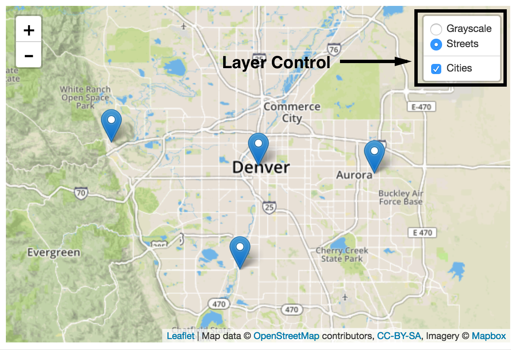

* Demonstrate to students how we can switch between a "Streets" and a "Grayscale" layer by toggling the Layers Control. Most students may have seen this type of functionality while using Google Maps or other similar services.

  * Leaflet has two types of layers:

    1. **Base Layers:** These are mutually exclusive to each other (only one can be visible at a time). In this example, they are the "Streets" and "Grayscale" layers. We can only see one or the other at a time, never both. One and only one of these must always be visible.

    2. **Overlays:** These go **over** the base layers and can be turned off entirely. In this example, the overlay layer contains the city markers.

  * We can group our markers together to create a new overlay layer with **layer groups**. This allows us to toggle on or off related markers as a group.

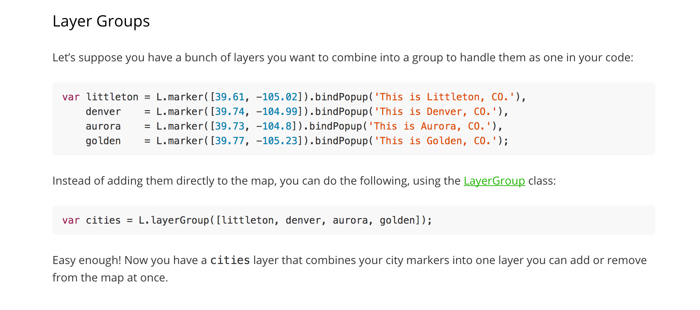

* Continue walking the class through the code in the example. Point out how markers are created in the same way as in all the previous activities up to this point. Then, instead of applying the markers directly to the map one at a time, we can add these markers to a layer group called "cities".

* Inform students that they should explore the [Leaflet documentation for layer controls](http://leafletjs.com/examples/layers-control/) for the next activity. It contains helpful examples they may not be able to complete the activity without.

  
<strong>✏️ 5.2 Students Do: Layer Activity (0:15)</strong>

* For this activity, we will return to our US cities map and re-factor the code to use layer groups and a layer control. In so doing, we will be able to represent the population for the entire state as well as the city.

* **Instructions:** [README](Activities/09-Stu_City_Population_Layers/README.md)

  
<strong>⭐ 5.3 Review: Layer Activity (0:05)</strong>

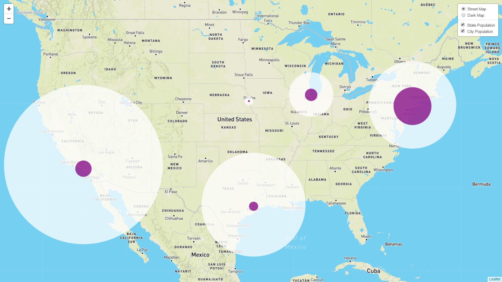
(City vs State population data)

* Slack out the [Solved](Activities/09-Stu_City_Population_Layers/Solved) version of the activity and go through it as a class. In particular, make sure to highlight the following:

  1. How we can create layer groups from markers by running the `L.layerGroup` method and passing in an array of layers we want to group.

  2. How we define our base maps and overlay maps by creating objects and passing them into the `L.control.layers` method. This creates labels used to identify the different layers in the layer control.

  3. How we define a `layers` property to our map's configuration and describe the layers we want to be active when the map is loaded.

  

* Congratulate the class for completing this activity. This map allows us to get a quick look at what portion of a state's population lives in its largest city! We can see that, in addition to having the largest population, New York also has the largest percentage of its state's population. Fun Fact: over 40% of New York state's population lives in New York City!

* Answer any other questions students may have about this example.

[Having issues with this activity? Report a bug!](https://bit.ly/3e0JHOB)

- - -
  
## 6. GeoJSON

| Activity Time:       0:30 |  Elapsed Time:      3:00  |
|---------------------------|---------------------------|

  
<strong>📣 6.1 Instructor Do: What is GeoJSON? (0:05)</strong>

* Inform students that, while that last example was good for learning purposes, most applications we build are going to be pulling from an existing dataset. One of the easiest ways to deliver geographical data is via a format called **GeoJSON**.

* Slack out the following link to students: <http://earthquake.usgs.gov/earthquakes/feed/v1.0/summary/all_hour.geojson> and open it in your browser.

* This is a GeoJSON document depicting all of the earthquakes that have taken place across the globe within the past hour.

* Explain that GeoJSON is an open standard format for representing simple geographical features, along with their non-spatial attributes, using JSON.

  * Geographical features are represented by coordinates and can have other properties attached to them.

  * The different types of features are:

    1. Point

    2. LineString

    3. Polygon

    4. MultiPoint

    5. MultiLineString

    6. MultiPolygon

  * We can feed the features data to the Leaflet `geoJSON` method, unmodified, and it will know what kind of marker it should make and where to place it. Point out the features objects inside the geoJSON response to students.

* Demonstrate how the data the class is viewing contains a set of geographical coordinates, as well as a list of properties, for each point. [The USGS Documentation](http://earthquake.usgs.gov/data/comcat/data-eventterms.php) goes into detail about the meaning of each property.

* Assure students that they won't need to worry about each abbreviation for this activity. For now, we just want to plot the time and location of each earthquake.

  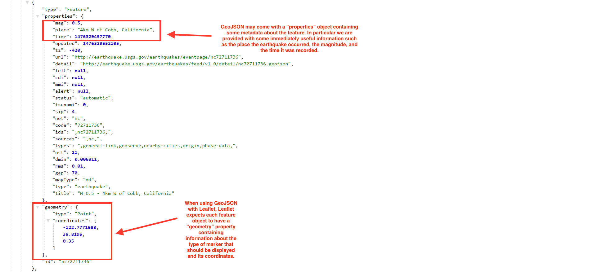
  (The GeoJSON for a single earthquake)

* Inform students that Leaflet has GeoJSON method which can be used to process and create markers using GeoJSON data as is, without any modifications. Encourage them to explore the Leaflet documentation to discover exactly how to handle GeoJSON with Leaflet.

  
<strong>✏️ 6.2 Students Do: GeoJSON activity (0:15)</strong>

* For this activity students will be working with GeoJSON data to plot occurrences of earthquakes.

* **Instructions:** [README](Activities/10-Stu_Geo-Json/README.md)

  
<strong>⭐ 6.3 Review: GeoJSON activity (0:10)</strong>

* When time's up, slack out [Stu_Geo_Json_Solved](Activities/10-Stu_Geo-Json/Solved) and walk students through the solution.

* Make sure they understand the following:

  1. Ask students which method we use to create a GeoJSON layer.

     * We pass **all** of the earthquake feature data into the `L.GeoJSON` method. We save its return value (the new Leaflet GeoJSON layer) to the `earthquakes` variable.

  2. What do they think is happening with the `onEachFeature` function we've defined?

     * `onEachFeature` is a built-in hook Leaflet provides during layer creation. We can define a function to perform some custom functionality with the addition of each feature object to the GeoJSON layer. In our case, we're giving each layer a popover with the time and location of the earthquake.

  3. What are `baseMaps` and `overlayMaps` for? Why not just add the layers directly to the map?

     * We could just add the GeoJSON layer directly to the map. But then we couldn't use a layer control with those layers.

       * After creating our GeoJSON layer, we create a `baseMaps` layer and an `overlayMaps` layer in the same way as in the previous activity. In this case, we're using earthquakes instead of cities for our overlay layer.

* Be sure to answer any further questions before dismissing class.

[Having issues with this activity? Report a bug!](https://bit.ly/2UOVUhV)

- - -

### Copyright

Trilogy Education Services © 2019. All Rights Reserved.
